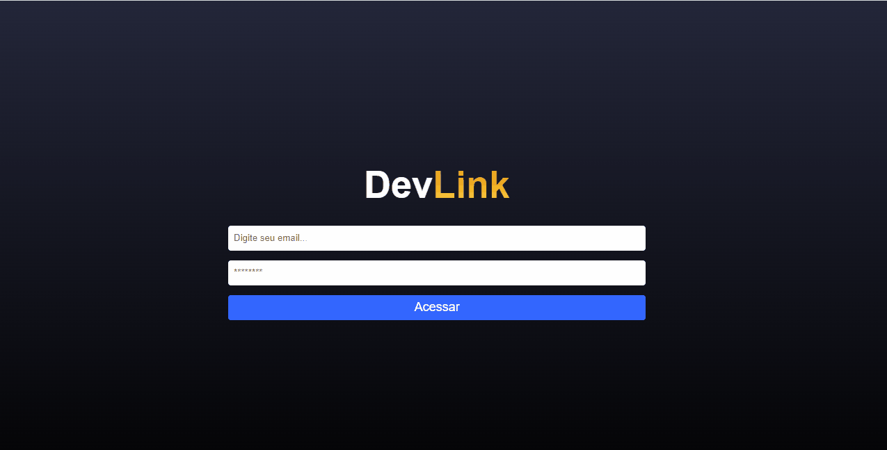

<h1 align='center'>Projeto DevLinks</h1>

<p align='center'>Esse projeto foi desenvolvido com a finalidade de consolidar oque foi aprendido e fazer algo que eu posso utilizar para uso pessoal, me desafiei e aprendi bastante coisas novas que fez aquecer ainda mais meu coração por essa área.</p>


<p align='center'>
<a href='#sobre'>Sobre</a> |
<a href='#visualização'>Visualização</a> |
<a href='#tecnologiass'>Tecnologias</a> 
</p>
<hr>

# Sobre

## Features

- [x] Não é permitido outro usuário acessar a página de Admin;

- [x] Barra de Navegação;

- [x] Adiciona e exclui links de contatos pessoais;

- [x] Da opção para o usuário escolher a cor de fundo do link e a cor do texto do link;

- [x] E expõe tudo na página home para outras pessoas que estão acessando o site;
<hr>

# Visualização

<h1 align="center">
   

   [Visualizar](dazzling-selkie-def801.netlify.app)
</h1>

### Pré-requisitos:

Antes de começar, você vai precisar ter instalado em sua máquina as seguintes ferramentas:
[Git](https://git-scm.com), [Node.js](https://nodejs.org/en/).
Além disto é bom ter um editor para trabalhar com o código como [VSCode](https://code.visualstudio.com/)

### Rodando o Front End

```bash
# Clone este repositório
$ git clone <https://github.com/matheusrodrigues1/devlink.git>

#instale as dependências 
$ npm

#execute a aplicação em modo de desenvolvimento
$ npm start
```
# Tecnologias

As seguintes ferramentas foram usadas na construção do projeto:

- [JavaScript](https://www.javascript.com/)
- [React](https://pt-br.reactjs.org/)
- [Styled-components](https://styled-components.com/)
- [Node.js](https://nodejs.org/en/)
---

Made with 💙 by MATHEUS 👋🏽 [See my LinkedIn](https://www.linkedin.com/in/matheus-rodrigues-1a1899231/)


